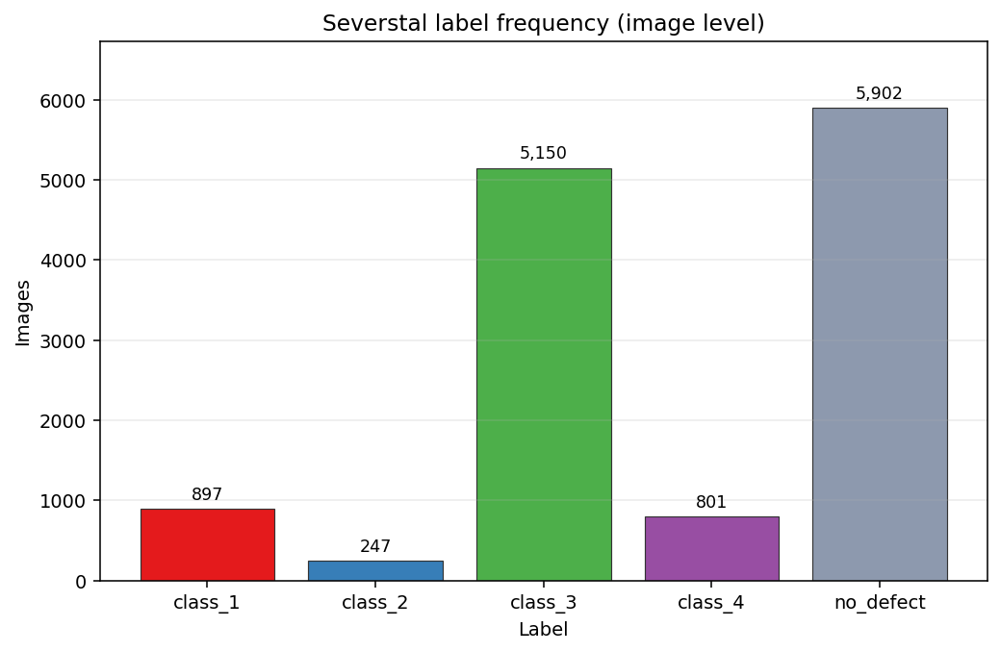
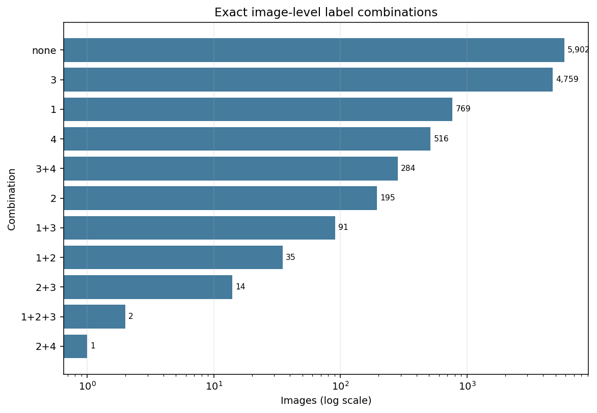
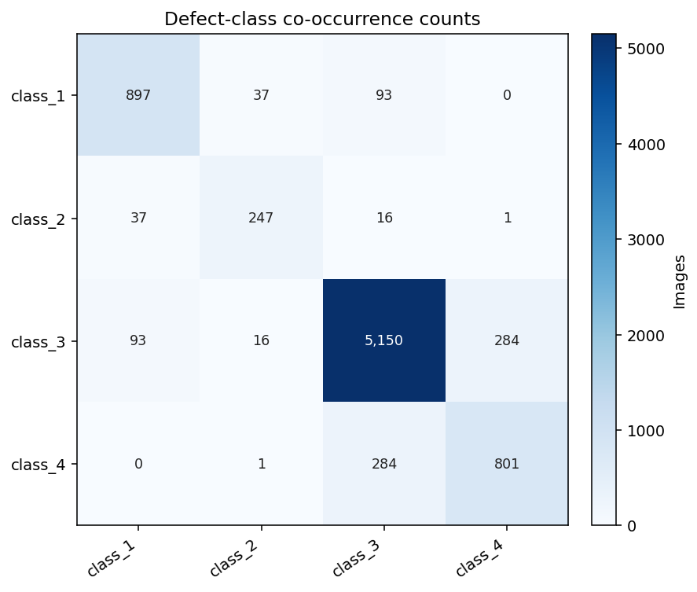
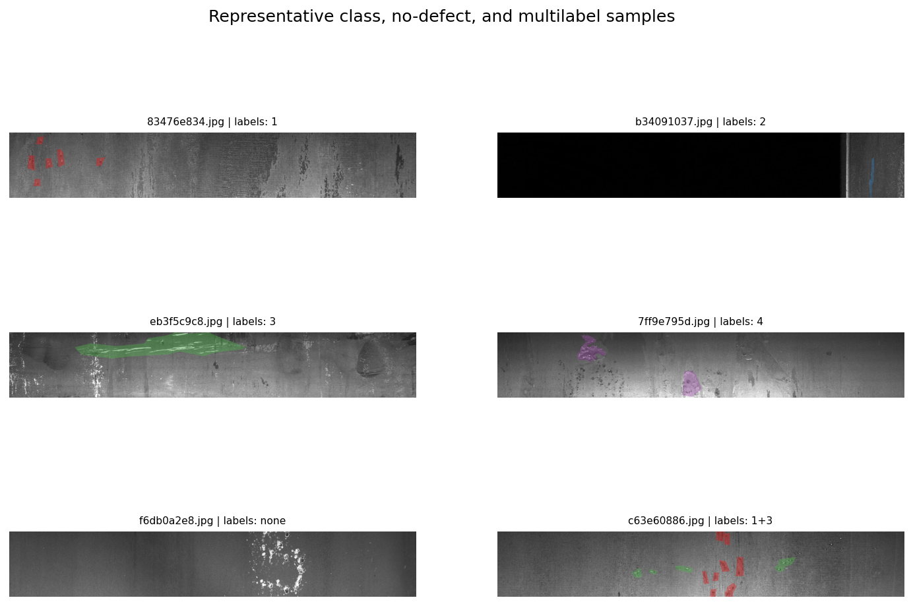
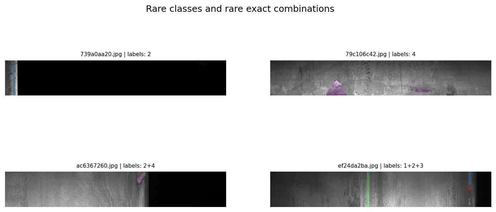

# Severstal 钢板缺陷 EDA 报告

本报告仅覆盖已批准的四项内容：标签频率、标签共现、样本可视化和稀有标签分析。原始 Kaggle 数据保持只读；统计分母为训练图片清单中的全部 12,568 张图片。

## 关键结论

- 有缺陷图片 6,666 张，无缺陷图片 5,902 张；无缺陷比例为 46.96%。
- 最常见正类别是 `class_3`，共有 5,150 张（占全部训练图 40.98%）。
- 最稀有单类别是 `class_2`，共有 247 张（1.97%）。
- 最稀有的已出现正标签组合是 `2+4`，仅 1 张。
- 多标签图片共有 427 张。共现矩阵用于显示组合数量，条件矩阵另存为 CSV，避免把方向性条件概率误读为对称关系。

## 标签频率

| label | image_count | image_fraction |
| --- | --- | --- |
| class_1 | 897 | 0.071372 |
| class_2 | 247 | 0.019653 |
| class_3 | 5150 | 0.409771 |
| class_4 | 801 | 0.063733 |
| no_defect | 5902 | 0.469605 |

## 精确标签组合

| combination | image_count | image_fraction |
| --- | --- | --- |
| none | 5902 | 0.469605 |
| 3 | 4759 | 0.378660 |
| 1 | 769 | 0.061187 |
| 4 | 516 | 0.041057 |
| 3+4 | 284 | 0.022597 |
| 2 | 195 | 0.015516 |
| 1+3 | 91 | 0.007241 |
| 1+2 | 35 | 0.002785 |
| 2+3 | 14 | 0.001114 |
| 1+2+3 | 2 | 0.000159 |
| 2+4 | 1 | 0.000080 |

## 标签共现

| label | class_1 | class_2 | class_3 | class_4 |
| --- | --- | --- | --- | --- |
| class_1 | 897 | 37 | 93 | 0 |
| class_2 | 37 | 247 | 16 | 1 |
| class_3 | 93 | 16 | 5150 | 284 |
| class_4 | 0 | 1 | 284 | 801 |

## 样本可视化

代表性样本固定使用种子 42，所选图片 ID 为：`83476e834.jpg, b34091037.jpg, eb3f5c9c8.jpg, 7ff9e795d.jpg, f6db0a2e8.jpg, c63e60886.jpg`。

## 稀有标签与微小掩码

稀有类别按图片数升序、标签名稳定排序；精确组合中的 `none` 不参与“稀有正标签组合”排名。掩码面积通过 RLE 长度直接求和，阈值比例相对于 256×1600 的图像面积计算。

| class_id | annotation_count | minimum_pixels | median_pixels | q95_pixels | maximum_pixels | proportion_below_1pct |
| --- | --- | --- | --- | --- | --- | --- |
| 1 | 897 | 163.000000 | 3326.000000 | 11502.000000 | 31303.000000 | 0.585284 |
| 2 | 247 | 316.000000 | 2944.000000 | 7138.400000 | 14023.000000 | 0.720648 |
| 3 | 5150 | 115.000000 | 11953.500000 | 94007.100000 | 368240.000000 | 0.185631 |
| 4 | 801 | 491.000000 | 25357.000000 | 98530.000000 | 192780.000000 | 0.034956 |

稀有样本 ID：`739a0aa20.jpg, 79c106c42.jpg, ac6367260.jpg, ef24da2ba.jpg`。

## 可复现性

- 配置：`config/eda_config.yaml`
- 随机种子：42
- 完整表格：`outputs/tables/`
- 运行摘要：`outputs/run_summary.json`
- 事件日志：`logs/eda_run.jsonl`
- SHA-256 清单：`MANIFEST.sha256`

本报告中的结论均来自本次执行生成的表格，不延伸到验证集划分、建模或提交策略。
